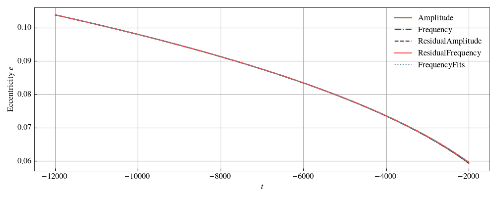

[](https://github.com/vijayvarma392/gw_eccentricity)
[](https://pypi.org/project/gw_eccentricity)
[](https://github.com/vijayvarma392/gw_eccentricity/blob/main/LICENSE)
[](https://github.com/vijayvarma392/gw_eccentricity/actions/workflows/test.yml)


# Welcome to gw_eccentricity!
**gw_eccentricity** provides methods to measure eccentricity and mean anomaly
from gravitational wave signals.

These methods are described in the following paper: <br/>
[1] FIXME.

If you find this package useful in your work, please cite reference [1] and
this package.

This package lives on
[GitHub](https://github.com/vijayvarma392/gw_eccentricity), is compatible with
python3, and is tested every week. You can see the current build status of the
main branch at the top of this page.


## Installation

### PyPI
**gw_eccentricity** is available through [PyPI](https://pypi.org/project/gw_eccentricity/):

```shell
pip install gw_eccentricity
```

### From source

```shell
git clone git@github.com:vijayvarma392/gw_eccentricity.git
cd gw_eccentricity
python setup.py install
```

If you do not have root permissions, replace the last step with
`python setup.py install --user`

## Dependencies

All of these can be installed through pip or conda.
* [numpy](https://docs.scipy.org/doc/numpy/user/install.html)
* [scipy](https://www.scipy.org/install.html)
* [h5py](http://docs.h5py.org/en/latest/build.html)
* [lalsuite](https://pypi.org/project/lalsuite)
* [gwtools](https://pypi.org/project/gwtools/)
* [palettable](https://pypi.org/project/palettable/)


## Usage
We provide ipython examples for usage of different methods.

### Get available methods
```python
>>> from gw_eccentricity.gw_eccentricity import get_available_methods
>>> list(get_available_methods().keys())
['Amplitude',
 'Frequency',
 'ResidualAmplitude',
 'ResidualFrequency',
 'FrequencyFits']
```

### Measure eccentricity and mean anomaly of `EccentricTD` waveform
#### Load waveform data
```python
>>> from gw_eccentricity.load_data import load_waveform
>>> lal_kwargs = {"approximant": "EccentricTD",
                  "q": 1.0,
                  "chi1": [0.0, 0.0, 0.0],
                  "chi2": [0.0, 0.0, 0.0],
                  "Momega0": 0.01,
                  "ecc": 0.1,
                  "mean_ano": 0,
                  "include_zero_ecc": True}
>>> dataDict = load_waveform("LAL", **lal_kwargs)
```
#### Measure eccentricity and mean anomaly at a single time using different methods
```python
>>> from gw_eccentricity.gw_eccentricity import measure_eccentricity
>>> tref_in = -12000
>>> for method in get_available_methods():
         tref_out, ecc_ref, meanano_ref = measure_eccentricity(
         tref_in=tref_in,
         method=method,
         dataDict=dataDict,
         extra_kwargs={"debug": False})
         print(method, ecc_ref, meanano_ref)
Amplitude 0.10377888168068325 5.951312106389669
Frequency 0.1037761976301291 5.95315171561444
ResidualAmplitude 0.10379109594072847 5.9605101525134865
ResidualFrequency 0.10379118014589635 5.961429957125872
FrequencyFits 0.10379128102227173 5.961429957125872
```
#### Measure eccentricity and mean anomaly at an array of times using different methods
```python
>>> from gw_eccentricity.plot_settings import use_fancy_plotsettings
>>> from gw_eccentricity.plot_settings import figWidthsTwoColDict, colorsDict, lstyles
>>> import numpy as np
>>> import matplotlib.pyplot as plt
>>> tref_in = np.arange(-12000, -2000, 0.1)
>>> use_fancy_plotsettings()
>>> fig, ax = plt.subplots(figsize=(figWidthsTwoColDict["Notebook"], 4))
>>> for method in get_available_methods():
         tref_out, ecc_ref, meanano_ref, eccMethod = measure_eccentricity(
         tref_in=tref_in,
         method=method,
         dataDict=dataDict,
         return_ecc_method=True,
         extra_kwargs={"debug": False})
         eccMethod.plot_measured_ecc(fig, ax, **{"label": method, "c": colorsDict[method], "ls": lstyles[method]})
```
<div> </div>

## Making contributions
See this
[README](https://github.com/vijayvarma392/gw_eccentricity/blob/main/README_developers.md)
for instructions on how to make contributions to this package.

## Credits
The main contributors to this code are [Md Arif Shaikh](https://md-arif-shaikh.github.io/), [Vijay
Varma](https://vijayvarma.com), and [Harald Pfeiffer](https://www.aei.mpg.de/person/54205/2784). You can find the full list of contributors
[here](https://github.com/vijayvarma392/gw_eccentricity/graphs/contributors).
Please report bugs by raising an issue on our
[GitHub](https://github.com/vijayvarma392/gw_eccentricity) repository.

## Eventually remove
For quick access to the paper: [](https://github.com/vijayvarma392/measure_eccentricity_paper/blob/pdflatex/paper.pdf)
